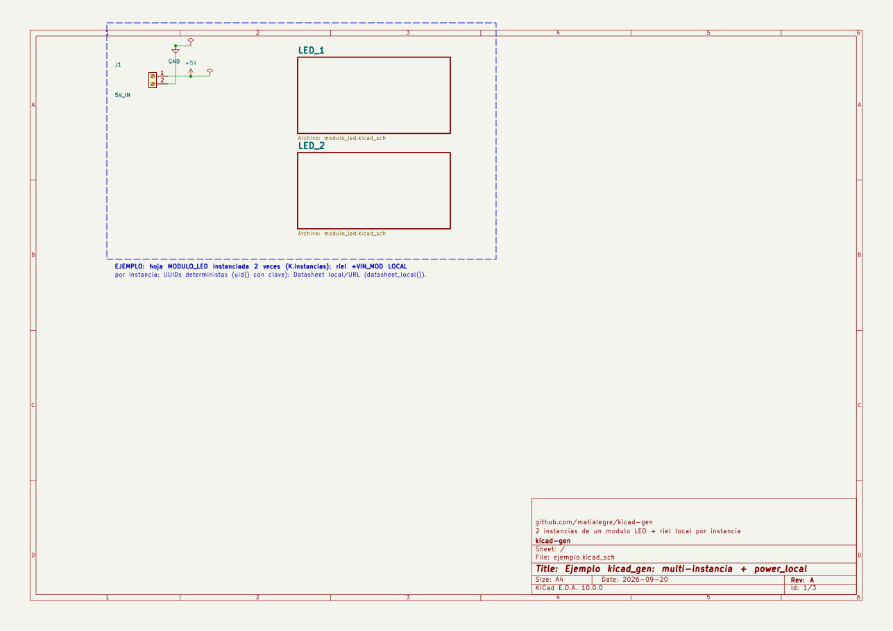

# kicad-gen

**Generate KiCad 10 schematics from Python code, and verify them with `kicad-cli`.**
*Esquemáticos de KiCad 10 generados por código Python y verificados con `kicad-cli`. [Castellano abajo](#castellano).*



You write the schematic as a Python script: explicit coordinates, real wires, power rails as
power symbols, hierarchical sheets. The script writes plain `.kicad_sch` files that open in
KiCad like any hand-drawn schematic, and a verification pipeline runs the ERC with every
severity enabled, checks for overlapping text, and exports PDF, netlist, BOM and PNG.
Same input, same file, byte for byte (deterministic UUIDs), so schematics diff cleanly in git.

## Files

| File | What it does |
|---|---|
| `kicad_gen.py` | The framework: `Sheet`, `Part` (with `.pin(n)` to wire to the exact pin), `wire`, `junction`, `rail` / `gnd` / `pwr_flag`, `hlabel` / `sheet_symbol` (hierarchical, multi-instance with `inst=`), `note` / `marco`, `modulo_symbol` (custom rectangular symbol), `power_variant` / `power_local` (renamed rail / per-instance local rail), `datasheet_local`, `instancias` / `instancias_multi` (one sheet reused N times), `write_sheet`, `chequear_geometria`, `chequear_referencias`. |
| `symlib.py` | Pulls a symbol's s-expression out of the official KiCad 10 libraries (resolves `extends`) and parses its pin positions. |
| `chequear_solapes_sch.py` | Text QA: fails if two visible texts overlap; reports rotated text and sheet usage (A4/A3/A2). Stdlib only. |
| `verificar.py` | Pipeline: ERC `--severity-all` + overlap check per sheet + PDF + netlist + BOM + one PNG per page. Exits 1 if anything fails (a warning counts as a failure). |
| `ejemplo/generar_ejemplo.py` | Smoke test and example: terminal block → `+5V` rail on the root sheet + a `MODULO_LED` sheet instantiated twice (R → LED → GND, fed by a per-instance local rail). ERC 0/0, references expanded per instance (R101/R201, D101/D201). |

## Requirements

- Python 3 (stdlib only; tested with 3.14). Optional: `pymupdf` for the PNG export.
- KiCad 10. Default paths are the Windows install (`C:\Program Files\KiCad\10.0`). On other
  systems or other install paths set:
  - `KICAD_SYMS` → the `share/kicad/symbols` folder
  - `KICAD_CLI` → the `kicad-cli` executable

## Quick start

```bash
cd ejemplo
python generar_ejemplo.py            # writes ejemplo.kicad_sch + modulo_led.kicad_sch
python ../verificar.py ejemplo.kicad_sch
# -> ERC: 0 errors 0 warnings, 0 text overlaps, PDF/NET/BOM/PNG ... RESULTADO: OK
```

Minimal script of your own (put the `.py` files next to it, or add this folder to `sys.path`):

```python
import kicad_gen as K
from kicad_gen import Part, wire, junction, gnd, rail, pwr_flag, load, use, note

K.configurar("my_project")                       # name of the .kicad_pro and the custom lib
R_ = load("Device", "R"); P5V_ = load("power", "+5V")

root = K.Sheet("ROOT", "my_project.kicad_sch", "A4", "Sheet title"); use(root)
r1 = Part("R1", "10k", R_, 60, 50,
          footprint="Resistor_THT:R_Axial_DIN0207_L6.3mm_D2.5mm_P10.16mm_Horizontal")
rail("+5V", *r1.pin(1), P5V_)                    # pin 1 of R is the top one
gnd(*r1.pin(2))

K.chequear_referencias([root]); K.chequear_geometria(root)
K.write_sheet(root, ".", rev="A", company="..."); K.write_custom_lib("."); K.write_project(".")
```

### Hierarchical sheets and multi-instance

```python
root = K.Sheet("ROOT", "p.kicad_sch", "A3", "Blocks")
mod = K.Sheet("RELAY", "relay_driver.kicad_sch", "A4", "Relay", page=2)
K.instancias(mod, root, ("3", "4"))          # 2 instances: refs K301.., K401..

use(mod); k1 = Part("K1", ...)               # inside the sheet refs stay short (K1, R1)
use(root)
sheet_symbol(mod, 20, 20, 40, 30, pins=[...], inst=0, nombre="RELAY_1")
sheet_symbol(mod, 20, 60, 40, 30, pins=[...], inst=1, nombre="RELAY_2")
K.chequear_referencias([root, mod])          # compares the EXPANDED refs (K301, K401)
```

A rail that must not merge across instances (a local `+3V3` per module) is declared with
`power_local`, not with the standard `power` symbol (that one is global and would tie every
instance to the same net). Each instance needs its own `pwr_flag`.

`Part(..., datasheet=K.datasheet_local(mpn, url))` points the Datasheet field to
`${KIPRJMOD}/hoja_de_datos/<mpn>.pdf` if that file exists (press D in KiCad to open it),
otherwise to the URL.

## Rules the code enforces (and why)

- **Units are u = 1.27 mm.** Official library pins land on multiples of 2.54 mm, so everything
  stays on grid. `wire()` aborts on a diagonal segment: it means a pin is not where you assumed;
  use `Part.pin(n)`.
- **`chequear_geometria`**: a wire end landing in the middle of another wire without a
  `junction()` is NOT connected in KiCad, and the ERC does not always catch it.
- **`chequear_referencias`**: duplicated references across sheets get merged in the netlist
  silently.
- **PWR_FLAG** only on nets fed by passive pins (connector, diode); with a `power_out` on the
  same net the ERC errors.
- **Footprints**: KiCad 10's ERC checks that the `Footprint` exists in the installed libraries
  (`footprint_link_issues`). Use the exact name or leave it empty.
- **Derived symbols** (`extends`, e.g. BC547): load the base symbol (`Q_NPN_CBE`) and put the
  part number in Value, otherwise `lib_symbol_mismatch`.
- **No rotated text, no overlaps**: `chequear_solapes_sch.py` measures it.

The code comments and identifiers are in Spanish (the author's language); the API is small and
the example covers it.

---

## Castellano

**Esquemáticos de KiCad 10 escritos como un script de Python y verificados con `kicad-cli`:
evidencia, no opinión.**

Se escribe el esquemático en Python (coordenadas explícitas, cables reales, rieles como
símbolos de power, hojas jerárquicas). El script genera `.kicad_sch` comunes, que KiCad abre
como cualquier esquemático dibujado a mano, y `verificar.py` corre el ERC con todas las
severidades, controla que no se pisen textos y exporta PDF, netlist, BOM y PNG. Misma entrada,
mismo archivo byte a byte (UUIDs deterministas): los esquemáticos se pueden comparar en git.

**Archivos:** `kicad_gen.py` (el framework), `symlib.py` (extrae símbolos de las libs oficiales
y la posición de sus pines), `chequear_solapes_sch.py` (QA de texto), `verificar.py` (pipeline
completo, sale 1 si algo falla, incluido un warning) y `ejemplo/` (prueba de humo: bornera →
riel `+5V` → hoja `MODULO_LED` instanciada 2 veces con riel local por instancia, ERC 0/0).

**Requisitos:** Python 3 (solo stdlib, probado con 3.14; `pymupdf` opcional para los PNG) y KiCad 10. Si no
está en `C:\Program Files\KiCad\10.0`, definir `KICAD_SYMS` (carpeta `share/kicad/symbols`) y
`KICAD_CLI` (el ejecutable `kicad-cli`).

**Probar:**

```bash
cd ejemplo
python generar_ejemplo.py
python ../verificar.py ejemplo.kicad_sch     # -> RESULTADO: OK
```

**Reglas que impone el código:** unidades u = 1,27 mm (todo en grilla; `wire()` aborta ante un
tramo diagonal), `chequear_geometria` (extremo de cable sobre otro cable sin `junction()` = no
conecta), `chequear_referencias` (refs repetidas entre hojas se funden en el netlist sin
aviso), PWR_FLAG solo en redes alimentadas por pines pasivos, huellas con el nombre exacto de
la lib instalada, símbolos derivados cargados por su base, cero texto rotado y cero solapes.

## License

MIT, see [LICENSE](LICENSE). Made by Matías Alegre, Pandemonium (PNDM).
